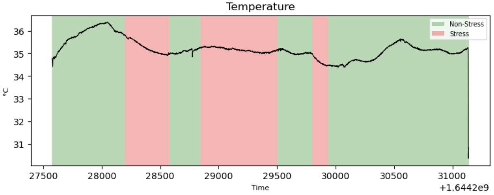

# Analysing Empatica E4 Watch Data
Welcome to our project, where we focus on analyzing stress detection patterns using data from the Empatica E4 watch. In this venture, we aim to leverage the potential of wearable technology for monitoring physiological signals that are indicative of stress. Our project is structured around the processing, analysis, and modeling of data involving key physiological parameters like Heart Rate (HR), Electrodermal Activity (EDA), Inter-Beat Interval (IBI), and Temperature (TEMP).

<figure>
  
  <div style="display:flex; align-items:center; justify-content: center;"><figcaption><b>Figure 1</b>: Features importance.</figcaption></div>
</figure>

We meticulously process data from 35 participants to extract meaningful insights. The study explores the correlations between these physiological signals and stress levels, employing advanced data processing techniques and machine learning algorithms, particularly a decision tree-based model. Our findings highlight the significance of selecting relevant biological features and the impact of proper data preprocessing in stress prediction.

This repository serves as a comprehensive guide, containing detailed scripts for data loading, preprocessing, modeling, and visualization. 

# 1. Requirements
This project is developed using Python version 3.8.13. It relies on the following third-party libraries:

```
-f https://data.pyg.org/whl/torch-2.0.1+cpu.html
numpy
pandas
scipy
seaborn
sklearn
matplotlib
json
dask
functools
```

# 2. Project Structure
```
project
│───assets                          # Contains visual assets like network diagrams and figures
│───Stress-Predict-Dataset-main     # Houses the raw data utilized during training
│   Dataloader.py                   # Script responsible for loading and preprocessing the raw dataset
│   Main.ipynb                      # Jupyter notebook containing the primary experimental workflow
│   Model.py                        # Script that encompasses various experimental ideas and approaches
│   README.md                       # Project Documentation.
│   Plot_data.py                    # Contains metric computation functions and methods
│   preprocessor.py                 # Script for managing and adjusting experimental parameters
│   process_data.csv                # Contains functions for generating and displaying plots
```

# 3. Instructions for Execution


## 3.2. Training the Model

To train the model:
1. Open the `main.ipynb` notebook.
2. Navigate to the **Run Training** section.
3. Multiple configurations are available for training. Choose the desired configuration and execute the respective cells.

## 3.3. Testing the Model

To test the model:
1. Open the `main.ipynb` notebook.
2. Navigate to the **Run Testing** section.
3. Various configurations are available for testing. Choose the desired configuration and execute the respective cells to test the model performance with different setups.

# 4. Features


## PCKh@0.5 Performance

<figure>
  
  <div style="display:flex; align-items:center; justify-content: center;"><figcaption><b>Figure 2</b>: Stacked Hourglass Network</figcaption></div>
</figure>                |


## PCKh@0.5 Performance
<figure>
  
  <div style="display:flex; align-items:center; justify-content: center;"><figcaption><b>Figure 2</b>: Stacked Hourglass Network</figcaption></div>
</figure>

## PCKh@0.5 Performance
<figure>
  
  <div style="display:flex; align-items:center; justify-content: center;"><figcaption><b>Figure 2</b>: Stacked Hourglass Network</figcaption></div>
</figure>

## PCKh@0.5 Performance
<figure>
  
  <div style="display:flex; align-items:center; justify-content: center;"><figcaption><b>Figure 2</b>: Stacked Hourglass Network</figcaption></div>
</figure>

## PCKh@0.5 Performance
<figure>
  
  <div style="display:flex; align-items:center; justify-content: center;"><figcaption><b>Figure 2</b>: Stacked Hourglass Network</figcaption></div>
</figure>


# 5. References
[1] Talha Iqbal, Andrew J. Simpkin, Davood Roshan, Nicola Glynn, John Killilea, Jane Walsh, Gerard Molloy, Sandra Ganly, Hannah Ryman, Eileen Coen, Adnan Elahi, William Wijns, and Atif Shahzad. 2022. _"Stress Monitoring Using Wearable Sensors: A Pilot Study and Stress-Predict Dataset"_, Sensors 22, no. 21: 8135. https://doi.org/10.3390/s22218135

[2] Talha Iqbal, Adnan Elahi, Sandra Ganly, William Wijns, and Atif Shahzad. _"Photoplethysmography-Based Respiratory Rate Estimation Algorithm for Health Monitoring Applications."_ Journal of medical and biological engineering 42, no. 2 (2022): 242-252. https://doi.org/10.1007/s40846-022-00700-z

